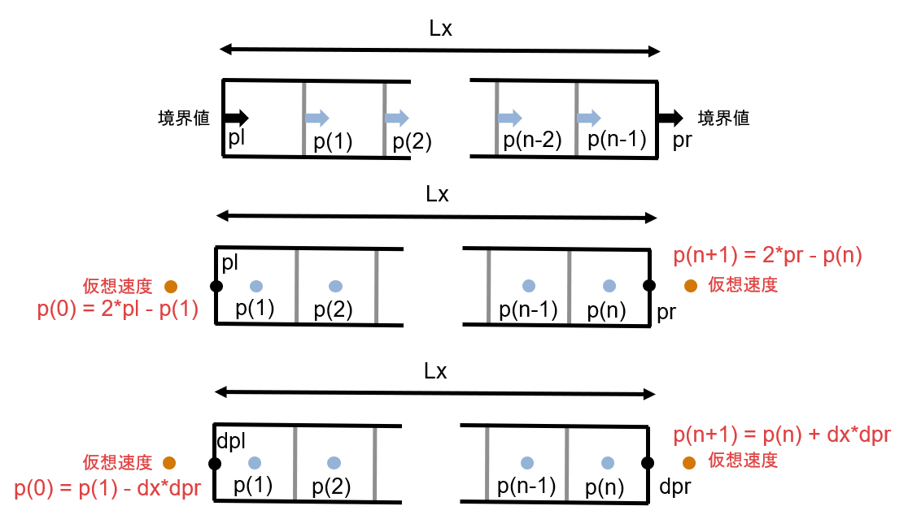
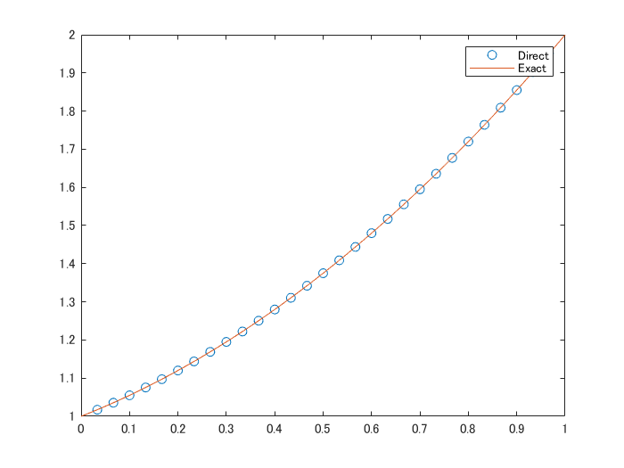

# いろんな状況でポワソン方程式を高速に解く
# はじめに


以前「[離散コサイン変換でポアソン方程式を高速に解く](https://qiita.com/eigs/items/cb607d647bc20c7db809)」で、離散コサイン変換 (DCT, **D**iscrete **C**osine **T**ransform) を使って直接法より10倍以上速く離散式を解く方法を紹介しました。


ただ、


   -  Dirichlet 境界条件だったらどうなんだ 
   -  Neumann 境界条件でも勾配が 0 じゃなかっただどうすればいい 
   -  変数の定義位置がセル中央じゃないんだけど・・ 


そんな様々な疑問もあったかと（勝手に）思います。ですので、この記事ではいろんな状況（境界条件・変数の定義位置）に**何変換で対応できるかを**まとめておきます。


  
## 本記事の内容


境界条件や変数の定義位置などよって、離散コサイン変換、離散サイン変換のどちらを使うかが分かれます。ここでは DST-I, DST-II, DCT-II それぞれを使うべき状況を、簡単な１次元ポワソン方程式で紹介します。（1次元でもポワソン方程式って呼んでいいのかな・・）


  
## きっかけ


「[非圧縮性 Navier-Stokes 方程式の数値解法２：拡散項の陰解法](https://qiita.com/eigs/items/5a62d9aff7d83af55099)」では拡散項に陰解法を用いることで、離散化されたヘルムホルツ方程式を毎ステップ解く必要があることを確認しました。これを直接法で解くのは時間がかかって大変そうだなぁ・・と考えていたところ、[@NaokiHori](https://qiita.com/NaokiHori) さんからコメント頂きました。


> 拡散項は陰的に扱う場合Helmholtz方程式に帰着すると思うので、FFTを使用した直接法も良いかもしれません。


それは考えていなかった・・ということで解法を確認してみました。


ポワソン方程式での例が長くなってうまくまとまらなかったので、ヘルムホルツ方程式への適用は別の記事にします。


  
## 環境


MATLAB R2020a


Signal Processing Toolbox (離散コサイン変換 `dct` の部分だけ）


基本的な機能しか使っていないので、最新でなくても機能するはずです（未確認）


  
# いろんな状況とは


ここでは以下の 3 種の状況を考えてみます。計算対象の状況（グリッド・境界条件など）が微妙に異なります。


上から順に：


   1.  セルエッジ上で変数が定義される Dirichlet 境界条件 
   1.  セル中央で変数が定義される Dirichlet 境界条件 
   1.  セル中央で変数が定義される Neumann 境界条件 





ここではグリッドは等間隔であるとします。1次元を想定し、ドメイン長さは  、グリッド数は  、グリッドサイズは とします。


  
## で、何変換を使う？


詳細は順次見ていきますが、結論を書いてしまうとそれぞれ


   1.  離散サイン変換（DST-I） 
   1.  離散サイン変換（DST-II \& DST-III） 
   1.  離散コサイン変換（DCT-II \& DCT-III） 


が活用できます。


**注意**：FFT を使って波数空間で解きますがスペクトル法ではない点はご注意ください。あくまで有限差分で離散化された式を FFT を使って高速に解くのが目的ですので、解の精度が上がるわけではありません。


  
## もちろん組み合わせもアリ


例えば「[非圧縮性 Navier-Stokes 方程式の数値解法２：拡散項の陰解法](https://qiita.com/eigs/items/5a62d9aff7d83af55099)」で出てくる速度  は x 軸方向に DST-I 、y軸方向に DST-II が使えますし、速度 は逆で x 軸方向に DST-II、y 軸方向に DST-I で解けます。さらに、圧力項に対するポワソン方程式を解く際には 両軸方向に DCT-II です（参考：「[離散コサイン変換でポアソン方程式を高速に解く](https://qiita.com/eigs/items/cb607d647bc20c7db809) 」）


1 次元だと直接法と比べてそんなにうまみはありませんが、2 次元、3 次元となると大きな違いになってきます。


  
# 離散ポワソン方程式を解いてみよう


もはや解析的に解けちゃう式ですが、違いが分かりやすいように 1 次元で考えます。右辺も思い切って定数 1 に固定。


単純な等間隔格子を想定した以下の有限差分式（２次精度）を題材にします。


連立線型方程式を行列で書くと


であり、注目すべき重要な点は以下の２つ。


   -  境界条件の違いによって 2 階微分オペレータ（行列） の正確な形 はちょっとずつ異なります。 
   -  境界条件に起因する数値は  に入ります。 


上で紹介した 3 つの条件で 解  （ は積分定数）が求まるかどうか確認します。


```matlab
clear, close all
addpath('../functions/')
```
# 1. セルエッジ上で変数が定義される Dirichlet 境界条件


境界条件は両端で与えられ、解くべき変数は  個です。領域を 、境界条件を  とすると解は


 


ですね。


## 離散式の確認


行列  で境界条件が絡むところを確認すると、


となります。はみ出た境界条件値 は右辺に移項します。


例えば  だと以下のような行列になります。（実際はさらに  で割ったもの）


```matlab
n = 6;
e = ones(n-1,1);
tmp = spdiags([e -2*e e],-1:1,n-1,n-1);
full(tmp)
```
```
ans = 5x5    
    -2     1     0     0     0
     1    -2     1     0     0
     0     1    -2     1     0
     0     0     1    -2     1
     0     0     0     1    -2

```


3 重帯行列です。


## 直接法


まずは直接法で解いてみます。


```matlab
n = 30; % グリッド数は 30 で（なんでもいいです）
e = ones(n-1,1);
tmp = spdiags([e -2*e e],-1:1,n-1,n-1);
```


領域の設定して  を計算


```matlab
pl = 1; pr = 2; % Bounary Condition
Lx = 1; % Domain size
dx = Lx/n; % Grid size
xedge = dx:dx:Lx-dx; % variable location
L1 = tmp/dx^2; % 
```


境界条件の値を右辺に移項して求解


```matlab
rhs = ones(n-1,1); % 右辺
rhs(1) = rhs(1) - pl/dx^2;
rhs(end) = rhs(end) - pr/dx^2;
p_direct = L1\rhs;
```


プロット


```matlab
plot(xedge,p_direct,'o')
hold on
fplot(@(x) x.^2/2 + x/2 + 1, [0,1])
hold off
legend(["Direct","Exact"])
```




解けましたね。


## 離散サイン変換の適用


FFTW の定義する [RODFT00 (DST-I)](http://www.fftw.org/fftw3_doc/1d-Real_002dodd-DFTs-_0028DSTs_0029.html) を使います。DST-I の逆変換も DST-I です。


この変換は、例えば [ABCD] というデータを [0,A,B,C,D,0,-D,-C,-B,-A] と拡張して周期データとするイメージです。今回の境界条件である Dirichlet 条件に合っていますね。境界値自体は右辺に移項するので 0 でなくても大丈夫です。


  
## 適用してみる


x 方向に対して離散サイン変換を適用すると


となります。これをもともとの差分式に代入してすると


ここで


です。Modified Wavenumber と呼ぶあれです。


こんな関係が役に立ちます。そうすると離散式は


と表すことができて、各  の組み合わせの数だけ独立した式になりました。


まず右辺を離散サイン変換（DST-I）して、上の式で  を求めて、逆離散サイン変換です。簡単！


やってみます。


```matlab
rhshat = mydst1(rhs); % まず右辺に離散サイン変換（DST-I）
kx = [1:n-1]';
a = pi*kx/(n);
mw = 2*(cos(a)-1)/dx^2; % Modified Wavenumber
phat = rhshat./mw;
p_dst = mydst1(phat); % 離散サイン変換（DST-I）で逆変換
```


先ほどの直接法でもとめた解との差を見てみると


```matlab
norm(p_dst-p_direct)
```
```
ans = 6.0521e-14
```


直接法で解いた答えとほぼ合ってますね！


  
# 2. セル中央で変数が定義される Dirichlet 境界条件


こちらも先ほどと同じく、境界条件自体はセルエッジ両端で定義されるのですが、解かれる変数はセル中央で定義されるケース（Staggered Grid）です。 2次精度の有限差分の場合、領域外に仮想速度を想定します。


1つ内部の点との内挿が境界値になるように  を想定し 、$p(n)$ おける 2 次微分を計算します。


解くべき変数は  個です。領域を そして  すると解は


 


ですね。先ほどと同じ。


  
## 離散式の確認


行列  で境界条件が絡むところを確認すると、


となります。はみ出た境界条件値 は右辺に移項します。


例えば  だと以下のような行列になります。（実際はさらに  で割ったもの）


```matlab
n = 6;
e = ones(n,1);
L = spdiags([e -2*e e],-1:1,n,n);
L(1,1) = -3;
L(end,end) = -3;
full(L)
```
```
ans = 6x6    
    -3     1     0     0     0     0
     1    -2     1     0     0     0
     0     1    -2     1     0     0
     0     0     1    -2     1     0
     0     0     0     1    -2     1
     0     0     0     0     1    -3

```


3 重帯行列です。前の例と少しだけ違います。


## 直接法


また、まずは直接法で解いてみます。


```matlab
n = 30; % グリッド数は 30 で（なんでもいいです）
e = ones(n,1);
tmp = spdiags([e -2*e e],-1:1,n,n);
tmp(1,1) = -3;
tmp(end,end) = -3;
```


領域の設定して  を計算


```matlab
pl = 1; pr = 2; % Bounary Condition
Lx = 1; % Domain size
dx = Lx/n; % Grid size
xcenter = dx/2:dx:Lx-dx/2; % variable location
L2 = tmp/dx^2; % 
```


境界条件の値を右辺に移項して求解


```matlab
rhs = ones(n,1); % 右辺
rhs(1) = rhs(1) - 2*pl/dx^2;
rhs(end) = rhs(end) - 2*pr/dx^2;
p_direct = L2\rhs;
```


プロット


```matlab
plot(xcenter,p_direct,'o')
hold on
fplot(@(x) x.^2/2 + x/2 + 1, [0,1])
hold off
legend(["Direct","Exact"])
```


はい。解けました。


## 離散サイン変換の適用


こんどはサイン変換でも FFTW の定義する [RODFT10 (DST-II)](http://www.fftw.org/fftw3_doc/1d-Real_002dodd-DFTs-_0028DSTs_0029.html) を使います。DST-II の逆変換は DST-III です。


この変換は、例えば [ABCD] というデータを [A,B,C,D,-D,-C,-B,-A] と拡張して周期データとするイメージです。変数が定義されている位置からグリッド半分だけずれている位置にある Dirichlet 条件に合っています。


  
## 適用してみる


x 方向に対して離散サイン変換を適用すると


となります。これをもともとの差分式に代入してすると


ここで


です。Modified Wavenumber と呼ぶあれです。


こんな関係が役に立ちます。そうすると離散式は


と表すことができて、各  の組み合わせの数だけ独立した式になりました。


この辺は先ほどとほとんど同じ。まず右辺を離散サイン変換（DST-II）して、上の式で  を求めて、逆離散サイン変換（DST-III）です。簡単！


やってみます。


```matlab
rhshat = mydst2(rhs); % まず右辺に離散サイン変換（DST-II）
kx = [1:n]';
a = pi*kx/(n);
mw = 2*(cos(a)-1)/dx^2; % Modified Wavenumber
phat = rhshat./mw;
p_dst = mydst3(phat); % 離散サイン変換（DST-III）で逆変換
```


先ほどの直接法でもとめた解との差を見てみると


```matlab
norm(p_dst-p_direct)
```
```
ans = 7.4354e-14
```


はい、できた。


# 3. セル中央で変数が定義される Neumann 境界条件


次に行きます。今度は境界条件が勾配である Neumann 条件である場合です。


上と同じく仮想速度を想定するのですが、 2次精度の有限差分の場合、1つ内部の点とで計算される勾配が、境界での勾配になるように仮想速度を想定し 、$p(n)$ おける 2 次微分を計算します。


境界条件は両端で与えられますが今回は勾配で与えられます。解くべき変数は  個です。


領域を そして境界での勾配を  とすると


 


です。**勾配条件だけで解は一意には求まりません。**定数分だけずれた解も正しい解です。ここでは


   -  直接法： p(1) を 0 に固定する 
   -  FFT を使った方法：平均値を 0 に固定する 


処理を加えます。


## 離散式の確認


行列  で境界条件が絡むところを確認すると、


となります。はみ出た境界条件値 は右辺に移項します。


例えば  だと以下のような行列になります。（実際はさらに  で割ったもの）


```matlab
n = 6;
e = ones(n,1);
L = spdiags([e -2*e e],-1:1,n,n);
L(1,1) = -1;
L(end,end) = -1;
full(L)
```
```
ans = 6x6    
    -1     1     0     0     0     0
     1    -2     1     0     0     0
     0     1    -2     1     0     0
     0     0     1    -2     1     0
     0     0     0     1    -2     1
     0     0     0     0     1    -1

```


3 重帯行列ですね。この流れ飽きてきましたね。


## 直接法


とはいえ、やっぱりまずは直接法で解いてみます。


```matlab
n = 30; % グリッド数は 30 で（なんでもいいです）
e = ones(n,1);
tmp = spdiags([e -2*e e],-1:1,n,n);
tmp(1,1) = -1;
tmp(end,end) = -1;
```


領域の設定して  を計算


```matlab
dpl = 1; dpr = 2; % Bounary Condition
Lx = 1; % Domain size
dx = Lx/n; % Grid size
xcenter = dx/2:dx:Lx-dx/2; % variable location
L3 = tmp/dx^2; % 
```


境界条件の値を右辺に移項して求解


```matlab
rhs = ones(n,1); % 右辺
rhs(1) = rhs(1) + dpl/dx;
rhs(end) = rhs(end) - dpr/dx;
p_direct = L3\rhs;
```
```
警告: 行列が特異なため、正確に処理できません。
```


上で触れた通り解が定まりません。ですので、 p(1) を 0 に固定して再度求解。


```matlab
L3(1,:) = zeros(1,n);
L3(1,1) = 1;
tmp_rhs = rhs;
tmp_rhs(1) = 0;
p_direct = L3\tmp_rhs;
```


プロット（理論解も p(1) の位置で 0 となるよう調整します）


```matlab
plot(xcenter,p_direct,'o')
hold on
x1 = xcenter(1);
fplot(@(x) x.^2/2 + x - (x1^2/2+x1), [0,1])
hold off
legend(["Direct","Exact"])
```


## 離散コサイン変換の適用


このケースは「[離散コサイン変換でポアソン方程式を高速に解く](https://qiita.com/eigs/items/cb607d647bc20c7db809)」の一次元版なので詳細は省きますが、DCT-II を使います。


　


まず右辺を離散コサイン変換（DCT-II）して、上の式で  を求めて、逆離散コサイン変換（DCT-III）です。簡単！


やってみます。


```matlab
rhshat = dct(rhs); % まず右辺に離散コサイン変換（DCT-II）
kx = [0:n-1]';
a = pi*kx/n;
mw = 2*(cos(a)-1)/dx^2; % Modified Wavenumber
phat = rhshat./mw;
p_dct = idct(phat); % 離散コサイン変換（DCT-III）で逆変換
```


先ほどの直接法でもとめた解との差を見てみると


```matlab
norm(p_dct-p_direct)
```
```
ans = NaN
```


はい、できてません。繰り返しになりますが、このままでは解が一意に定まらないんです。


```matlab
mw(1)
```
```
ans = 0
```


と Modified Wavenumber が 0 になっていて、ゼロ割が発生しているのが直接の要因です。先ほど、解の平均値を 0 とする処理を加えると書きましたが、それは k = 0 に相当する成分（平均値）を 0 にすることに相当します。


```matlab
phat(1) = 0;
p_dct = idct(phat); % 離散コサイン変換（DCT-III）で逆変換
```


プロットしてみると・・


```matlab
plot(xcenter,p_direct,'o')
hold on
plot(xcenter,p_dct,'x')
x1 = xcenter(1);
fplot(@(x) x.^2/2 + x - (x1^2/2+x1), [0,1])
hold off
legend(["Direct","DCT","Exact"])
```


予想通り定数分だけずれているように見えます。ずれを補正して誤差を確認してみます。


```matlab
diffp = p_dct(1)-p_direct(1);
norm(p_direct-p_dct+diffp)
```
```
ans = 3.2725e-14
```


解けています。


# まとめ


長くなってしまいましたが、以下 3 つのケースを紹介しました。


   1.  セルエッジ上で変数が定義される Dirichlet 境界条件：離散サイン変換（DST-I） 
   1.  セル中央で変数が定義される Dirichlet 境界条件：離散サイン変換（DST-II と DST-III） 
   1.  セル中央で変数が定義される Neumann 境界条件：離散コサイン変換（DCT-II と DCT-III） 


1次元のかなり単純な問題を例にしましたがより複雑な問題へも応用してもらえると思います。境界値、境界での勾配値は任意の値でOKというところも確認できました。繰り返しになりますが、スペクトル法ではない点はご注意ください。あくまで有限差分で離散化された式を FFT を使って高速に解くのが目的ですので、解の精度は上がりません。


次回は「[非圧縮性 Navier-Stokes 方程式の数値解法２：拡散項の陰解法](https://qiita.com/eigs/items/5a62d9aff7d83af55099)」で出てくるヘルムホルツ方程式に適用して、どれくらい高速化できるのか確認してみたいと思います。（FFT が使える等間隔グリッドである必要がある点は大きな制約ですが・・）


