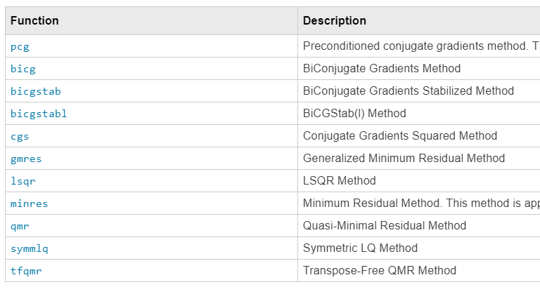

# <span style="color:rgb(213,80,0)">CFD 101: Crank-Nicolson and Adams-Bashforth for Viscous Terms</span>

Copyright (c) 2020, The MathWorks, Inc.

# Introduction

In this document, we describe the implicit treatment of the viscous terms in the Navier-Stokes equation for better stability at low Reynolds numbers. At the same time, two steps Adams-Bashforth and three steps Runge-Kutta are described and implemented for better time-integration stability and accuracy. 


This document is part 2 of the CFD 101 series.

# Goal of this document
-  Understand how to implement Crank-Nicolson for viscous terms 
-  Understand how to appy Adams-Bashforth for convective terms. 
-  Simulate at high Reynolds number (Re = 5,000 below) 

<p style="text-align:left"></p>


The discussion below is based on Adams-Bashforth for simplicity, but more robust (but expensive) Runge-Kutta is also implemented. See Appendix.

## Environment
-  MATLAB R2019b 
-  Signal Processing Toolbox* 

*: It's recommended. The code below uses `dct` function from Signal Processing Toolbox to solve the Poisson equation for pressure, but this part can be replaced by iterative solver or directly inverting the matrices, which does not require any additional toolboxes. Examples are also provided.

# Stability of Viscous & Convective Terms

Popular Neumann's stability analysis and Courant number discussions. The point is the following:


The stability condition of the diffusion equation with a central difference and explicit Euler integration is

 $$ dt\le \frac{\Delta^2 }{2/Re} $$ 

and we need 1/4 of the time step if we 1/2 the grid size. Also, the condition is severe for lower Reynolds numbers, which explains why the solution in part 1 diverges at a low Reynolds number. It is known that implicit treatment provides unconditional stability.


For the convection equations, the Courant number (c is the velocity）

 $$ c\frac{dt}{\Delta } $$ 

comes into play and we need to keep the Courant number not exceeding $C_{max}$ which depends on the method used. Based on the observation we use $C_{max} =0.5$ for Adams-Bashforth.

# Fractional Step Method with Implicit treatment 
## Recap from part 1

The 1st order explicit Euler integration gives

 $$ \begin{array}{rl} \frac{u^{n+1} -u^n }{dt} & =-Gp-{{Nu}}^n +\frac{1}{Re}{{Lu}}^n \\ {{Du}}^{n+1}  & =bc^{n+1}  \end{array} $$ 

and

 $$ \left\lbrack \begin{array}{cc} I & G\\ D & 0 \end{array}\right\rbrack \left\lbrack \begin{array}{c} u^{n+1} \\ p^{\prime }  \end{array}\right\rbrack =\left\lbrack \begin{array}{c} r^n \\ 0 \end{array}\right\rbrack +\left\lbrack \begin{array}{c} 0\\ bc \end{array}\right\rbrack $$ 

in a matrix form.

## Crank-Nicolson and Adams-Bashforth

The implicit Crank-Nicolson scheme is used for linear (viscous) terms and second-order Adams-Bashforth scheme for non-linear terms. The discrete form of the above equation can be written as

 $$ \begin{array}{rl} \frac{u^{n+1} -u^n }{dt} & =-Gp-\frac{3}{2}{{Nu}}^n +\frac{1}{2}{{Nu}}^{n-1} +\frac{1}{2Re}\left({{Lu}}^{n+1} +bc_L^{n+1} +{{Lu}}^n +bc_L^n \right)\\ {{Du}}^{n+1}  & =bc_D^{n+1}  \end{array} $$ 

Or in the matrix form, as

 $$ \left\lbrack \begin{array}{cc} A & G\\ D & 0 \end{array}\right\rbrack \left\lbrack \begin{array}{c} u^{n+1} \\ p^{\prime }  \end{array}\right\rbrack =\left\lbrack \begin{array}{c} r^n \\ 0 \end{array}\right\rbrack +\left\lbrack \begin{array}{c} 0\\ bc_D  \end{array}\right\rbrack $$ 

where

 $$ \begin{array}{rl} A & =I-\frac{dt}{2Re}L\\ {r^n } & =u^n +dt\left\lbrace -\frac{3}{2}{{Nu}}^n +\frac{1}{2}{{Nu}}^{n-1} +\frac{1}{2Re}\left(bc_L^{n+1} +{{Lu}}^n +bc_L^n \right)\right\rbrace  \end{array} $$ 

where $A$ is the implicit operator for the advection-diffusion part of the momentum equation, $N$ is the convective operator, $G$ is the gradient operator, $D$ is the divergence operator, ${r^n }$ is the explicit right-hand side of the momentum equation, $bc_L$ is the boundary condition vector from the viscous term and $bc_D$ is the boundary condition vector for the incompressibility constraint. Only the viscous term is treated implicitly here and has the velocity field of the next time step ( ${u^{n+1} }$ ). 

## Block LU factorization

The fractional step method is related to the block LU factorization of the equation above (Perot 1993 [1])

 $$ \left\lbrack \begin{array}{cc} A & 0\\ D & -{DA^{-1} G} \end{array}\right\rbrack \left\lbrack \begin{array}{cc} I & {A^{-1} G}\\ 0 & I \end{array}\right\rbrack \left\lbrack \begin{array}{c} u^{n+1} \\ p^{\prime }  \end{array}\right\rbrack =\left\lbrack \begin{array}{c} r^n \\ 0 \end{array}\right\rbrack +\left\lbrack \begin{array}{c} 0\\ bc_D  \end{array}\right\rbrack $$ 

This is exact but computationally very expensive since calculating the inverse of $A$ is not practical. Hence it is usually solved approximating ${A^{-1} }$ . Different approximations to the inverse result in different classes of fractional step method.


The classic fractional step method corresponds to using $A^{-1} =I+O(dt)$ , which results in a first-order error term. By choosing $A^{-1} =I+\frac{dt}{2Re}L+O(dt^2 )$ , the resulting error is 2nd order. In the case of $A^{-1} =I+O(dt)$ ,

 $$ \left\lbrack \begin{array}{cc} A & 0\\ D & -{DG} \end{array}\right\rbrack \left\lbrack \begin{array}{cc} I & G\\ 0 & I \end{array}\right\rbrack \left\lbrack \begin{array}{c} u^{n+1} \\ p^{\prime }  \end{array}\right\rbrack =\left\lbrack \begin{array}{c} r^n \\ 0 \end{array}\right\rbrack +\left\lbrack \begin{array}{c} 0\\ bc_D  \end{array}\right\rbrack $$ 

## to the Fractional Step Method

The single time step reduces to the following sequence of operations,

 $$ \begin{array}{cl} Au^*  & =r^n \\ {DG}p^{\prime }  & =Du^* +bc_D \\ u^{n+1}  & =u^* -Gp^{\prime }  \end{array} $$ 

The difference from part 1 is the first equation, namely

 $$ \begin{array}{rl} Au^*  & =r^n \;\;{\mathrm{w}\mathrm{h}\mathrm{e}\mathrm{r}\mathrm{e}}\;\;A=I-\frac{dt}{2Re}L\\ {r^n } & =u^n +dt\left\lbrace -\frac{3}{2}{{Nu}}^n +\frac{1}{2}{{Nu}}^{n-1} +\frac{1}{2Re}\left(bc_L^{n+1} +{{Lu}}^n +bc_L^n \right)\right\rbrace  \end{array} $$ 

and we need to solver the system of equation ${Au^* }={r^n }$ for both $u$ and $v$ .


It should be noted that the $L$ operator acts only on the velocity inside the domain excluing the boundary conditions, thus we have $bc_L^{n+1}$ on the right hand side.

# MATLAB implementation

Enough equations already. Let's put everything in MATLAB. Please refer to each function on the repository for details, but we would like to highlight the following three points.

-  The matrices that we need to solve for viscous term 
-  How to deal with the boundary condition  
-  How to solve the equations 

Again, the sole difference from the previous Euler method is the following equation to solve for the intermediate velocity.

 $$ \left(I-\frac{dt}{2Re}L\right){u^* }=u^n +dt\left\lbrace -\frac{3}{2}{{Nu}}^n +\frac{1}{2}{{Nu}}^{n-1} +\frac{1}{2Re}\left(bc_L^{n+1} +{{Lu}}^n +bc_L^n \right)\right\rbrace $$ 

In the MATLAB code (see <samp>updateVelocityField_CNAB.m</samp> for details)

<pre>
    % Implicit treatment for xy direction
    b = u(2:end-1,2:end-1) + dt*(-3*Nu+Nu_old)/2 + dt/(2*Re)*(Lux+Luy+Lubc);
    xu = getIntermediateU_xyCNAB(u, b, dt, Re, Nx, Ny, dx, dy);
    b = v(2:end-1,2:end-1) + dt*(-3*Nv+Nv_old)/2 + dt/(2*Re)*(Lvx+Lvy+Lvbc);
    xv = getIntermediateV_xyCNAB(v, b, dt, Re, Nx, Ny, dx, dy);
    
    u(2:end-1,2:end-1) = xu;
    v(2:end-1,2:end-1) = xv;
</pre>

Euler method (see <samp>updateVelocityField_Euler.m</samp> for details)

<pre>
    u(2:end-1,2:end-1) = u(2:end-1,2:end-1) - dt*Nu + dt/Re*(Lux+Luy);
    v(2:end-1,2:end-1) = v(2:end-1,2:end-1) - dt*Nv + dt/Re*(Lvx+Lvy);
</pre>

So simple!


Anyways, you can find the essense in <samp>getIntermediateU_xyCNAB.m and</samp>  <samp>getIntermediateV_xyCNAB.m.</samp> CNAB denotes Crank-Nicolson, Adams-Bashforth

## Viscous Operator

Let us revisit the $L$ that you can find in $A$ . The difference equation is 

 $$ Lu(i,j)=\frac{u(i-1,j)-2u(i,j)+u(i+1,j)}{\Delta x^2 }+\frac{u(i,j-1)-2u(i,j)+u(i,j+1)}{\Delta y^2 } $$ 

 $$ Lv(i,j)=\frac{v(i-1,j)-2v(i,j)+v(i+1,j)}{\Delta x^2 }+\frac{v(i,j-1)-2v(i,j)+v(i,j+1)}{\Delta y^2 } $$ 

and $L$ is only tri-diagonal matrix if you decides to apply implicit method for x-direction only. With the implicit treatment for both x,y direction, $L$ becomes a little wider, but sparse matrix anyways. The size of the matrix is


 $(nx-1)\cdot ny\times (nx-1)\cdot ny$ for $u$  


 $nx\cdot (ny-1)\times nx\cdot (ny-1)$ for $v$ 


and the number of element is $\mathcal{O}(n^4 )$ but the number of non-zero element is $\mathcal{O}(n^3 )$ . The inconsistency in size for $u$ and $v$ stem from the use of the staggered-grid system.

### Sidenote: Implicit for one direction only?

For the boundary layer flow, for example, it was shown in Simens (2008), that the viscous time-step requirement could be more severe than the convective restriction only in the wall-normal direction in the case of a stretched grid that is usually employed in wall-bounded turbulence to resolve small-scale phenomena close to the wall. In such a case, it makes sense to apply an implicit method for one direction, and the equation can be solved more efficiently.

## Boundary condition

Here we review where the term $bc_L$ comes from. The staggered-grid cell configuration and its indexes are sketched below.

<p style="text-align:left"></p>


The velocity in orange is the "ghost velocity" and calculated as (for example)

 $$ u(i,1)=2u_{bc} -u(i,2) $$ 

The idea is that the mean (2nd order interpolation) of the two velocities across the boundary becomes the boundary value. Since the ghost velocity has the value of the inside the domain, how we treat the boundary affects the definition of $L$ . 


For example, at the bottom boundary, the y-component of the viscous term for $u$ becomes

 $$ \begin{array}{rl} Lu_y (i,2) & =\frac{u(i,3)-2u(i,2)+u(i,1)}{dy^2 }\\  & =\frac{u(i,3)-3u(i,2)}{dy^2 }+\frac{2u_{bc} }{dy^2 } \end{array} $$ 

And the coefficients for $u(i,2)$ is now -3 and the second term of the right hand side goes to $L_{bc}^{n+1}$ . On the contrary, the x-component of the viscous term for $u$ at the left boudnary becomes

 $$ \begin{array}{rl} Lu_x (2,j) & =\frac{u(3,j)-2u(2,j)+u(1,j)}{dx^2 }\\  & =\frac{u(3,j)-2u(2,j)+u_{bc} }{dx^2 }\\  & =\frac{u(3,i)-2u(2,i)}{dx^2 }+\frac{u_{bc} }{dx^2 } \end{array} $$ 

The coeffients for $u(i,2)$ is kept being -2. The ghost velocity is not required and $L$ directly refers to the boundary value.


The situation is oppisite for the $v$ , and $Lv$ requires ghost velocity for the x-component of the viscous terms.

## So what are the matrices like?

For small number of grid sizes, let <samp>getL4u.m</samp> calculate the $L$ for $u$ .

```matlab
clear, close all
addpath('../functions/')

Lx = 1; Ly = 1;
nx = 5; ny = 5;
dx = Lx/nx; dy = Ly/ny;
maskU = false(nx+1,ny+2);
maskU(2:end-1,2:end-1) = true;
L4u = getL4u(nx,ny,dx,dy,maskU);
spy(L4u);
```

<center></center>


Sparse it is. The actual values are..

```matlab
full(L4u(1:nx,1:nx))
```

```TextOutput
ans = 5x5    
 -125.0000   25.0000         0         0   25.0000
   25.0000 -125.0000   25.0000         0         0
         0   25.0000 -125.0000   25.0000         0
         0         0   25.0000 -125.0000         0
   25.0000         0         0         0 -100.0000
```

**Sidenote**:  <samp>maskU</samp> is the logical array with true where $u$ is defined. <samp>getL4u.m</samp> calculates $L$ for more complex geometry as long as we defined <samp>maskU</samp> properly. For the current case, we have trues simply surrounded by falses (boundary)

```matlab
maskU
```

```TextOutput
maskU = 6x7 の logical 配列    
   0   0   0   0   0   0   0
   0   1   1   1   1   1   0
   0   1   1   1   1   1   0
   0   1   1   1   1   1   0
   0   1   1   1   1   1   0
   0   0   0   0   0   0   0
```
## Solving the system of linear equations

MATLAB is indeed good at solving ${Au^* }={r^n }$ and there exist so many build-in functions. We have implemented three. For the actual implementation, please refer to <samp>getIntermediateU_xyCNAB.m.</samp>


As observed above $A$ is a sparse matrix.

```matlab
dt = 0.01; Re = 100; % a random test case
A4u = eye(size(L4u),'like',L4u)-dt/(2*Re)*L4u; % A matrix for u 
spy(A4u)
```

<center></center>

### Method 1: Directly

MATLAB backslash works nicely for sparse matrix too. 

```matlab
r = rand(nx-1,ny);
xu = A4u\r(:);
```
### Method 2: Decompose + Directly

If we have fixed time-step size <samp>dt</samp> and Reynolds number <samp>Re</samp>, we can pre-decompose the $A$ and the backslash operation becomes much faster by reuse the matrix decompositions, though it requires more memory to store them.


[decomposition Object](https://jp.mathworks.com/help/matlab/ref/decomposition.html) uses the decomposition type is automatically chosen based on the properties of the input matrix.

```matlab
A4u = decomposition(A4u); 
xu1 = A4u\r(:);
```

For this method to work, we need to make use of the [persistent variable](https://jp.mathworks.com/help/matlab/ref/persistent.html).

### Method 3: Iteratively

MATLAB has [11 algorithms](https://jp.mathworks.com/help/matlab/math/systems-of-linear-equations.html#brzoiix) ready.

<p style="text-align:left"></p>


Here we choose <samp>cgs</samp> since it does not require symmetry nor positive definite.

```matlab
A4u = eye(size(L4u),'like',L4u)-dt/(2*Re)*L4u;
xu2 = cgs(A4u,r(:));
```

```TextOutput
cgs は、相対残差 6.5e-11 をもつ解に 反復 2 で収束しました。
```

The use of preconditioner helps convergence, thus the computational time, but still, it requires the constant time step size dt and Reynolds number.


**Sidenote**: The useful nature of the iterative method is that we do not have to explicitly prepare the matrices.

```matlab
xu4 = cgs(@(x) operatorAu_CNAB(x,dt,Re,nx,ny,dx,dy),r(:));
```

```TextOutput
cgs は、相対残差 6.5e-11 をもつ解に 反復 2 で収束しました。
```

You can specify the first input argument as a function handle such that the function returns ${Au^* }$ (here <samp>operatorAu_CNAB.m)</samp>

<pre>
Ax = x - dt/(2*Re)*(xbig(1:end-2,2:end-1)-2*xbig(2:end-1,2:end-1)+xbig(3:end,2:end-1))/dx^2; % nx-1 * ny
Ax = Ax - dt/(2*Re)*(xbig(2:end-1,1:end-2)-2*xbig(2:end-1,2:end-1)+xbig(2:end-1,3:end))/dy^2; % nx-1 * ny
Ax = Ax(:);
</pre>

The difference equation can be directly written in code.

# Animation of the Velocity Field

Let's animate the flow with Re = 5,000. The numerical integration process discussed above is now in the function <samp>updateVelocityField_CNAB.m.</samp>


**NOTE**: Somehow, the code gives an error with <samp>recordGIF = true</samp> if you are running in R2019b or earlier. If you want to record the animation to GIF, please run <samp>script_AnimateVelocityField_part2.m</samp> instead.

## Setting up Environment
```matlab
Re = 5000; % Reynolds number
nt = 3000; % max time steps
Lx = 1; Ly = 1; % domain size
Nx = 80; Ny = 80; % Number of grids
dt = 0.003; % time step;
% Grid size (Equispaced)
dx = Lx/Nx;
dy = Ly/Ny;
% Coordinate of each grid (cell center)
xce = ((1:Nx)-0.5)*dx;
yce = ((1:Ny)-0.5)*dy;
% Coordinate of each grid (cell corner)
xco = (0:Nx)*dx;
yco = (0:Ny)*dy;
```

Initialize the flow field.

```matlab
u = zeros(Nx+1,Ny+2); % velocity in x direction (u)
v = zeros(Nx+2,Ny+1); % velocity in y direction (v)
uce = (u(1:end-1,2:end-1)+u(2:end,2:end-1))/2; % u at cell center
vce = (v(2:end-1,1:end-1)+v(2:end-1,2:end))/2; % v at cell center
```
## Setting up Visualization

Downsample the velocity field at the interval of <samp>visRate</samp> so that the plot is not going to be filled with arrows. Also GIF is updated (appended) at every <samp>recordRate</samp> time steps.

```matlab
visRate = 4; % downsample rate of the data for quiver
recordGIF = false; % set to true if you wanna make GIF
recordRate = 20;
filename = 'animation_sample.gif'; % Specify the output file name
```

Contour plot

```matlab
figure
[Xce,Yce] = meshgrid(xce,yce); % cell center grid
[~,h_abs] = contourf(Xce',Yce',sqrt(uce.^2+vce.^2)); % contour
```

```TextOutput
警告: 等高線図は ZData が定数の場合はレンダリングされません
```

```matlab
hold on
```

Quiver plot

```matlab
% Downsample the data（d = downsampled）
xced = xce(1:visRate:end);
yced = yce(1:visRate:end);
[Xced,Yced] = meshgrid(xced, yced);

uced = uce(1:visRate:end,1:visRate:end);
vced = vce(1:visRate:end,1:visRate:end);
h_quiver = quiver(Xced',Yced',uced,vced,3,'Color',[1,1,1]);

hold off
xlim([0 Lx]); ylim([0 Ly]);
```

Additional arrow representing the bounary condition at the top lid.

```matlab
harrow = annotation('textarrow',[0.3 0.7],[0.96 0.96],"LineWidth",2);
```

Delete the ticks/tick labels.

```matlab
haxes = gca;
haxes.XTick = [];
haxes.YTick = [];
```
## Start the Simulation

Just to make it a little fun, the velocity of the top lid reverses at the 1000 steps (out of 3000 steps).

```matlab
initialFrame = true;

for ii = 1:nt
    bctop = 1; % top velocity
    
    if ii > 1000
        bctop = -1;
        harrow.X = [0.7, 0.3]; % inverse the arrow
    end
    
    % Update the velocity field (uses dct)
    [u,v] = updateVelocityField_CNAB_bctop(u,v,Nx,Ny,dx,dy,Re,dt,bctop,'dct');
%     [u,v] = updateVelocityField_RK3_bctop(u,v,Nx,Ny,dx,dy,Re,dt,bctop,'dct');
    
    % Update the plot at every recordRate steps
    if mod(ii,recordRate) == 0
        % get velocity at the cell center (for visualization)
        uce = (u(1:end-1,2:end-1)+u(2:end,2:end-1))/2; % u at cell center
        vce = (v(2:end-1,1:end-1)+v(2:end-1,2:end))/2; % v at cell center
        % update plot (downsample)
        h_quiver.UData = uce(1:visRate:end,1:visRate:end);
        h_quiver.VData = vce(1:visRate:end,1:visRate:end);
        h_abs.ZData = sqrt(uce.^2+vce.^2);
        
        drawnow
        
        if recordGIF
            frame = getframe(gcf); %#ok<UNRCH> % Figure 画面をムービーフレーム（構造体）としてキャプチャ
            tmp = frame2im(frame); % 画像に変更
            [A,map] = rgb2ind(tmp,256); % RGB -> インデックス画像に
            if initialFrame
                imwrite(A,map,filename,'gif','LoopCount',Inf,'DelayTime',0.1);
                initialFrame = false;
            else
                imwrite(A,map,filename,'gif','WriteMode','append','DelayTime',0.1);% 画像をアペンド
            end
        end
        
    end
end
```

<center></center>

# Summary

We haven't yet validated the result or anything, but it seems to work fine with high Reynolds number.


In this document, we have discussed the Crank-Nicolson and Adams-Bashfoth. It's observed that the simulation still diverges with high Renolds number if the time step size is not small enough. If you find the simualtion is not working please try Runge-Kutta instead by replacing

<pre>
    [u,v] = updateVelocityField_CNAB_bctop(u,v,Nx,Ny,dx,dy,Re,dt,bctop,'dct');
</pre>

by

<pre>
    [u,v] = updateVelocityField_RK3_bctop(u,v,Nx,Ny,dx,dy,Re,dt,bctop,'dct');
</pre>
# Appendix: Runge-Kutta

The low-storage third-order semi-implicit Runge–Kutta method of Spalart et al. (1991)[3] is also implemented for the temporal discretization to achieve a higher order of temporal accuracy. See <samp>updateVelocityField_RK3.m</samp>. The equations to be solved at each step then become

 $$ \begin{array}{rl} A & =r^n \;\;{\mathrm{w}\mathrm{h}\mathrm{e}\mathrm{r}\mathrm{e}}\;\;A=I-\beta_i \frac{dt}{Re}L\\ {r^n } & =u^n +dt\left\lbrace -\gamma_j {{Nu}}^n -\zeta_i {{Nu}}^{n-1} +\frac{1}{Re}\left(\alpha_i \left({{Lu}}^n +bc_L^n \right)+\beta_i bc_L^{n+1} \right)\right\rbrace  \end{array} $$ 

where

 $$ \begin{array}{lll} \alpha_1 =4/15, & \alpha_2 =1/15, & \alpha_3 =1/6,\\ \beta_1 =4/15, & \beta_2 =1/15, & \beta_3 =1/6,\\ \gamma_1 =8/15, & \gamma_2 =5/12, & \gamma_3 =3/4,\\ \zeta_1 =0, & \zeta_2 =-17/60, & \zeta_3 =-5/12. \end{array} $$ 

It required three times as much as a computation for a one-time step, but it allows a bigger time step size.

# References

[1] B. Perot, An analysis of the fractional step method. J. Comp. Physics, 108: 51-58, 1993


[2] Simens, M.P., Jim´enez, J., Hoyas, S. and Mizuno, Y. 2009 A high-resolution code for turbulent boundary layers. Journal of Computational Physics 228 (11), 4218-4231.


[3] Spalart, P.R., Moser, R.D. and Rogers, M.M. 1991 Spectral methods for the Navier-Stokes equations with one infinite and two periodic directions. Journal of Computational Physics 96 (2), 297-324.

