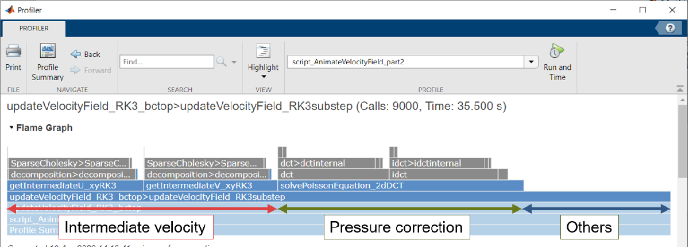
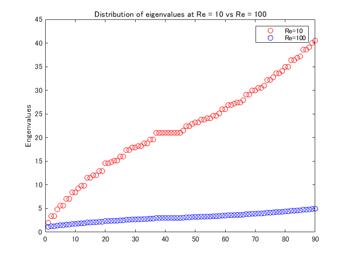

# <span style="color:rgb(213,80,0)">CFD 101: Performance Comparison of the Implicit Methods</span>

Copyright (c) 2020, The MathWorks, Inc.

# Introduction

This document is part 3 of the CFD 101 series.


In part 2, it was observed that using the implicit method requires solving the discretized Helmholtz equation every time step for each component of the velocity, namely, 

 $$ Au^* =r^n \;\;{\mathrm{w}\mathrm{h}\mathrm{e}\mathrm{r}\mathrm{e}}\;\;A=I-\frac{dt}{2Re}L $$ 

When we use the direct method with matrix factorization (observed to be the fastest in this document), the process of calculating the velocity field accounts for about 40% of the total calculation, so this is worth paying attention to how we solve the equations.

<p style="text-align:left"></p>

## Environment

MATLAB R2020a

# Goal of this document

We compare the performance of the following five methods to solve the equation mentioned above.

-  Method 1: Direct method 
-  Method 2: Matrix factorization + direct method 
-  Method 3: Iterative method 
-  Method 4: Preconditioned iterative method 
-  Method 5: Discrete sine transformation 

In part 3, we have already introduced the direct method, the direct method with matrix decomposition, and the iterative method to solve the above equation. Here we briefly describe the preconditioning for the iterative method and how we use the discrete sine transform in solving the equation.

## Bottom Line on Top

This is how it turned out.

-  The discrete sine transformation is an order of magnitude faster than the direct method. 
-  The direct method isn't so bad if you can pre-decompose the matrix. 
-  Even using the preconditions, the iterative method... didn't perform well. 

As long as the time step size and Reynolds number are kept constant, the decomposed matrix can be reused, and it performs as fast as the discrete sine transformation. Note that it expects to use more memory to store the decomposed matrices, which is observed to use roughly seven times as much memory as the original matrix. Of course, it depends on the finite difference scheme to be used.


Please be noted that the iterative method is calculated with a fixed required accuracy. It will converge faster with the loosened the condition, and it also depends on the Reynolds number and the time step size.

<p style="text-align:left"></p>


Note: The number of grids here is that for 1-direction. The actual size of the matrix being solved is (number of grid^2) x (number of grid^2) for a 2D case.

# Solver details

We describe the preconditioning of the iterative method and the use of discrete sine transform. The other three methods, namely, 

-  Method 1: Direct method 
-  Method 2: Matrix factorization + direct method 
-  Method 3: Iterative method 

are omitted because they were introduced in the previous article, "Implicit Solving of Diffusion Terms."

## Equations

Let us revisit the discretized Helmholtz equation. Here, only the velocity u in the x-axis is considered.

 $$ Au^* =r^n \;\;{\mathrm{w}\mathrm{h}\mathrm{e}\mathrm{r}\mathrm{e}}\;\;A=I-\frac{dt}{2Re}L $$ 

First, let's look at the matrix ${\mathrm{A}}$ to be solved.

```matlab
addpath('../functions/')
clear
rng(0)
N = 10; % test with small matrix

% Computational domain setting
Lx = 1; Ly = 1;
nx = N; ny = N;
dx = Lx/nx; dy = Ly/ny;

% RHS is random numbers
rhs = rand(nx-1,ny);

% Matrix for divergence term
maskU = false(nx+1,ny+2);
maskU(2:end-1,2:end-1) = true;
L4u = getL4u(nx,ny,dx,dy,maskU);

% Setting for time-step size and the Reynolds number
dt = 1; Re = 10;
A4u = speye(size(L4u))-dt/(2*Re)*L4u; % A matrix for u
spy(A4u)
```

<center></center>


```matlab
issymmetric(A4u)
```

```TextOutput
ans = 
   1
```

It's a symmetric matrix.

# Method 4: Preconditioned iterative method

There are symmetric matrices, but here we try CGS (conjugate gradient squared), which requires neither symmetric nor positive definite matrices. The required accuracy is set to $10^{-6}$ and the maximum number of iterations to 10,000.

```matlab
tol = 1e-6;
maxit = 1e4;
[u,flag0,relres0,iter0,resvec0] = cgs(A4u,rhs(:),tol,maxit);
```

Looking at the errors and the number of iterations

```matlab
relres0 % error
```

```TextOutput
relres0 = 4.9261e-07
```

```matlab
iter0 % number of iterations
```

```TextOutput
iter0 = 15
```

It appears to have converged after 15 iterations.

## With Preconditioning

Precondition matrices increase convergence speed.


The points are:

-  The convergence of the iterative method depends on the eigenvalue distribution of the coefficient matrix 
-  The smaller the eigenvalue distribution and the closer to 1, the faster the convergence. 
-  The eigenvalue distribution will be improved by applying a preprocessing matrix. 

and here we solve for ${\mathrm{A}{\mathrm{M}}^{-1} \mathrm{M}\mathrm{x}}={\mathrm{b}}$ with precondition matrix ${\mathrm{M}}$ . Examples can be found in MATLAB's official documentation of, say the cgs function. Commonly used preprocessing methods include the following:

-   Incomplete LU Factorization 
-   Incomplete Cholesky Factorization 

Using an incomplete inverse matrix allows decrease the number of non-zero elements. With the full LU decomposition, displaying the non-zero elements together with the L/U,

```matlab
[L,U] = lu(A4u);
spy(L+U)
```

<center></center>


shows that there are 1564 non-zero elements, and the incomplete LU factorization gives 412.

```matlab
[L,U] = ilu(A4u); % 'nofill'
spy(L+U)
```

<center></center>


Compared to L and U by full LU decomposition, the number of non-zero elements is small. Let us solve the equation using the L and U as a preconditioning matrices,

```matlab
[u,flag1,relres1,iter1,resvec1] = cgs(A4u,rhs(:),tol,maxit,L,U);
```

Looking at the errors and the number of iterations

```matlab
relres1
```

```TextOutput
relres1 = 5.1845e-07
```

```matlab
iter1
```

```TextOutput
iter1 = 5
```

It seems to have converged after five iterations. Plotting the number of iterations and the remaining error at that time, it is easy to see the effect of the preconditioning.

```matlab
figure
semilogy(0:length(resvec0)-1,resvec0/norm(rhs),'-o')
hold on
semilogy(0:length(resvec1)-1,resvec1/norm(rhs),'-o')
hold off
yline(tol,'r--');
legend('No preconditioner','ILU preconditioner','Tolerance','Location','East')
xlabel('Iteration number')
ylabel('Relative residual')
```

<center></center>


In fact, the A4u matrix depends on dt (time step size) and Re (Reynolds number). For example, the larger the Reynolds number, the smaller the value of the non-diagonal component of ${\mathrm{A}}$ (as it approaches the diagonal matrix) and the convergence tends to be faster. The point is that the convergence speed varies depending on the conditions, so it's not easy to compare speeds.

## Eigenvalue distribution

If we look at the distribution of eigenvalues for the Reynolds numbers 10 and 100, we can see that the larger the Reynolds number, the smaller the eigenvalues are.

```matlab
Re10 = 1e1; % Reynolds number = 10
A4u1e1 = speye(size(L4u))-dt/(2*Re10)*L4u; % A matrix for u
Re100 = 1e2; % Reynolds number 100
A4u1e2 = speye(size(L4u))-dt/(2*Re100)*L4u; % A matrix for u
figure
plot(eig(A4u1e1),'or')
hold on
plot(eig(A4u1e2),'ob')
hold off
legend(["Re=10","Re=100"])
ylabel('Engenvalues')
title('Distribution of eigenvalues at Re = 10 vs Re = 100')
```

<center></center>

# Method 5: Discrete sine transformation

The velocity in the x-axis direction <samp>u</samp> has the following boundary conditions:

-  Dirichet boundary condition (x-axis direction) in which the variable is defined on the cell edge. 
-  Dirichet boundary condition (y-axis direction) in which the variable is defined in the center of the cell. 

As described in the earlier article "Solving the Poisson equation fast in various situations" (in Japanese only), we can apply DST-I on the x-axis and DST-II on the y-axis to solve the problem in wavenumber space. Note that the inverse of DST-I is DST-I itself, and that of DST-II is DST-III.

```matlab
kx = [1:nx-1]';
ax = pi*kx/(nx);
mwx = 2*(cos(ax)-1)/dx^2;% DST-I

ky = [1:ny]';
ay = pi*ky/(ny);
mwy = 2*(cos(ay)-1)/dy^2; % DST-II

mw = mwx+mwy'; % Modified Wavenumber

% mydst* applies DST to each column
% dst1 in column and transpose and dst2 then transpose back
rhshat = mydst2(mydst1(rhs).').';

% A4u = speye(size(L4u))-dt/(2*Re)*L4u; % A matrix for u
uhat = rhshat./(1-dt/(2*Re)*mw);
u = mydst1(mydst3(uhat.').');

norm(rhs(:)-A4u*u(:))
```

```TextOutput
ans = 9.2596e-15
```

The equation is indeed solved.

# Comparison of Processing Speed

The processing speed of methods 1 to 5 is measured. To get closer to the actual situation, we compare with a time step size of 0.01 and a Reynolds number of 100.

```matlab
ntests = 10; % Number of test cases
dt = 0.01; Re = 100;

pw = 1:ntests;
times = zeros(ntests,5);
for ii=2:ntests
    N = 2^ii; % N = 4,8,16,...,512,1024
    
    % Computational domain setting
    Lx = 1; Ly = 1;
    nx = N; ny = N;
    dx = Lx/nx; dy = Ly/ny;
    
    % Viscous term operator L
    maskU = false(nx+1,ny+2);
    maskU(2:end-1,2:end-1) = true;
    L4u = getL4u(nx,ny,dx,dy,maskU);
    
    % (1-dt/2Re*L) 
    A4u = speye(size(L4u))-dt/(2*Re)*L4u; % A matrix for u
    rhs = rand(nx-1,ny); % Random numbers for RHS
    
    % 1. Direct Method
    f_direct = @() A4u\rhs(:);
    
    % 2. Direct Method + Decompose
    dA4u = decomposition(A4u);
    f_decompose = @() dA4u\rhs(:);
    
    % 3. Iterative (cgs)
    f_cgs = @() getIntermediateU_cgs(A4u,rhs);
    
    [L,U] = ilu(A4u);
    % 4. Preconditioned Iterative (cgs)
    f_precondcgs = @() getIntermediateU_precondcgs(A4u,rhs,L,U);
    
    % 5. Discrete Sine Transform
    kx = [1:nx-1]';
    ax = pi*kx/(nx);
    mwx = 2*(cos(ax)-1)/dx^2;% DST-I
    
    ky = [1:ny]';
    ay = pi*ky/(ny);
    mwy = 2*(cos(ay)-1)/dy^2; % DST-II
    
    % A4u in frequency domain
    A4uhat = (1-dt/(2*Re)*(mwx+mwy'));
    f_dst = @() getIntermediateU_DST(A4uhat,rhs);
    
    % timeit to measure the process time
    times(ii,1) = timeit(f_direct,1);
    times(ii,2) = timeit(f_decompose,1);
    times(ii,3) = timeit(f_cgs,1);
    times(ii,4) = timeit(f_precondcgs,1);
    times(ii,5) = timeit(f_dst,1);
end

%% Visualize the results
figure(1)
loglog(2.^(1:ntests),times,'Marker','o','LineWidth',4);

% Some cosmetics
handle_axes = gca;
handle_axes.FontSize = 14;
box(handle_axes,'on');
grid(handle_axes,'on');

legend({'Direct Method','Decompose + Direct Method', ...
    'Iterative Method','Preconditioned Iterative Method', ...
    'Discrete Sine Transform'},'Location','best');
grid on
xlabel('Number of grids')
ylabel('Processing time (s) ')
title('Processing time vs Grid number')
hold off
```

<center></center>


# Summary

Solving the Helmholtz equation for the velocity is inevitable when using the implicit solution method. We compared the processing time required for each of the following five methods.

-  Method 1: Direct method 
-  Method 2: Matrix factorization + direct method 
-  Method 3: Iterative method 
-  Method 4: Preconditioned iterative method 
-  Method 5: Discrete sine transformation 

And here are how it turned out.

-  The discrete sine transformation is an order of magnitude faster than the direct method. 
-  The direct method isn't so bad if you can pre-decompose the matrix. 
-  Even using the preconditions, the iterative method... didn't perform well. 

If you can use discrete sine transformation (even grid spacing), this seems to be the best in performance and easy to implement. The next option is the matrix decomposition + direct method, which can also be used for the complex geometry and uneven grid. 


Please note that the discussion above is only valid for the serial processing cases. When the parallel computation is involved, we need to reevaluate them.

# Appendix: Helper functions
```matlab
function u = getIntermediateU_cgs(A4u,rhs)

[u,~] = cgs(A4u,rhs(:),1e-6,1e4);

end

function u = getIntermediateU_precondcgs(A4u,rhs,L,U)

[u,~] = cgs(A4u,rhs(:),1e-6,1e4,L,U);

end

function u = getIntermediateU_DST(A4uhat,rhs)

rhshat = mydst2(mydst1(rhs).').';
uhat = rhshat./A4uhat;
u = mydst1(mydst3(uhat.').');

end
```
