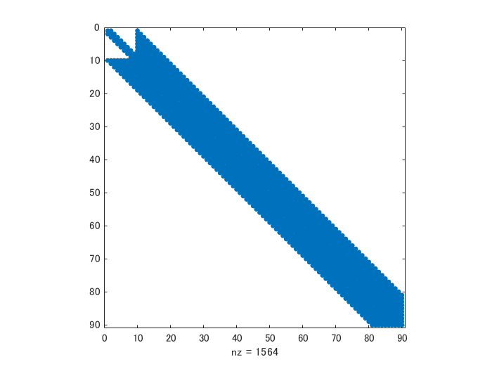
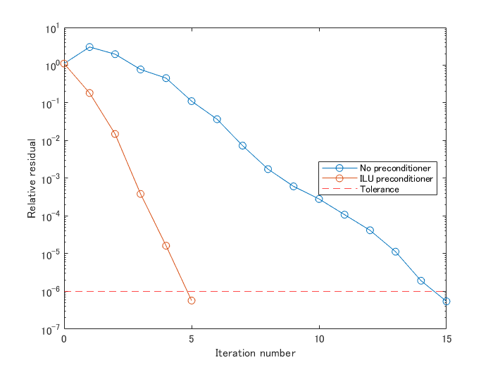
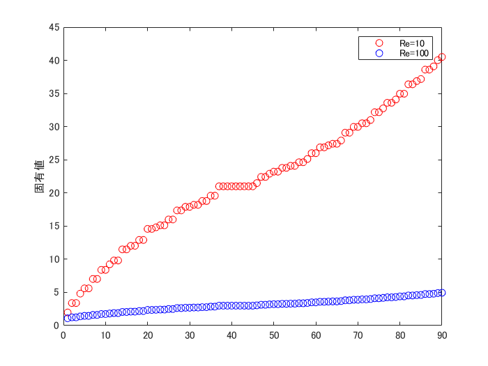

# 非圧縮性 Navier-Stokes 方程式の数値解法３：陰解法の解き方比較


Copyright (c) 2020, The MathWorks, Inc.


# はじめに


Navier-Stokes 方程式を数値的に解くシリーズ、第３回目です。


   -  非圧縮性 Navier-Stokes 方程式の数値解法１：導入編 
   -  非圧縮性 Navier-Stokes 方程式の数値解法２：拡散項の陰解法 
   -  **非圧縮性 Navier-Stokes 方程式の数値解法３：陰解法の解き方比較** 


引き続き非圧縮性 Navier-Stokes 方程式の数値解法について。[非圧縮性 Navier-Stokes 方程式の数値解法２：拡散項の陰解法](https://qiita.com/eigs/items/5a62d9aff7d83af55099) では、陰解法を用いると、離散化されたヘルムホルツ方程式を毎ステップ解く必要がでてくることを確認しました。


この式です。


最も速い「行列分解をした直接法」を使ったとしても、速度場を計算する処理は全体の40％ほどを占めていますので、結構重要なポイント。


# 本記事の内容


以前の記事「拡散項の陰解法」の [連立方程式の解法](https://qiita.com/eigs/items/5a62d9aff7d83af55099#%E9%80%A3%E7%AB%8B%E6%96%B9%E7%A8%8B%E5%BC%8F%E3%81%AE%E8%A7%A3%E6%B3%95) の項目では、上式の解法として「直接法」、「行列分解をした直接法」、「反復法」について紹介しています。


ここでは [@NaokiHori](https://qiita.com/NaokiHori) さんにヒントを頂いた離散サイン変換を使った方法、前処理付き反復法を加えて、以下の 5 つの処理速度を比較してみます。


   -  方法１：直接法 
   -  方法２：行列分解＋直接法 
   -  方法３：反復法 
   -  方法４：前処理付き反復法 
   -  方法５：離散サイン変換 

## 実行環境


MATLAB R2020a


## 結論から言うと・・


こんな結果になりました。


   -  離散サイン変換使うと直接法と比べて 1 桁速い 
   -  行列の事前分割ができれば直接法も悪くない 
   -  前条件を使っても反復法は・・成果が出ませんでした 


時間ステップやレイノルズ数が変わらないという条件が必要ですが、行列の事前分割ができれば直接法もいい感じですね。その分メモリを必要とする点は注意が必要。今回の例だと、分解後の行列には元の行列の大体 7 倍のメモリを使っていました。使用する差分法でも変わるはず。


反復法では要求精度固定で計算していますので、条件を緩めれば緩めるだけ早くはなりますし、レイノルズ数によっても収束速度が変わりますので、一概に結論付けはできません。


ここでの「グリッド数」は 1 方向の領域分割数です。2 次元を想定しているので実際の行列のサイズは  です。


  
# 各手法の解説


ヘルムホルツ方程式の解法として、ここでは離散サイン変換を使った方法と、反復法の高速化について紹介します。


   -  方法１：直接法 
   -  方法２：行列分解＋直接法 
   -  方法３：反復法 


の ３つについては以前の記事「拡散項の陰解法」の [連立方程式の解法](https://qiita.com/eigs/items/5a62d9aff7d83af55099#%E9%80%A3%E7%AB%8B%E6%96%B9%E7%A8%8B%E5%BC%8F%E3%81%AE%E8%A7%A3%E6%B3%95)で紹介していますので省きます。


## 解く方程式


離散化されたヘルムホルツ方程式を確認します。ここでは x 軸方向の速度 u のみを対象とします。


まず解くことになる行列  を確認してみます。


```matlab:Code
addpath('../functions/')
clear
rng(0)
N = 10; % ひとまず小さい行列サイズで

% 計算領域設定
Lx = 1; Ly = 1;
nx = N; ny = N;
dx = Lx/nx; dy = Ly/ny;

% 試しに右辺は乱数
rhs = rand(nx-1,ny);

% 拡散項の行列
maskU = false(nx+1,ny+2);
maskU(2:end-1,2:end-1) = true;
L4u = getL4u(nx,ny,dx,dy,maskU);

% お試し設定
dt = 1; Re = 10;
A4u = speye(size(L4u))-dt/(2*Re)*L4u; % A matrix for u
spy(A4u)
```


```matlab:Code
issymmetric(A4u)
```


```text:Output
ans = 
   1

```


対称行列ですね。


# 方法４：前処理付き反復法


まず、比較のために前処理無しでやってみます。


対称行列はありますが、ここは対称行列も正定行列も要求しない `cgs`（共役傾斜二乗法）を試します。要求精度は 。最大反復数は 10,000 にします。


```matlab:Code
tol = 1e-6;
maxit = 1e4;
[u,flag0,relres0,iter0,resvec0] = cgs(A4u,rhs(:),tol,maxit);
```


誤差と反復回数を見てみると、


```matlab:Code
relres0 % 誤差
```


```text:Output
relres0 = 4.9261e-07
```


```matlab:Code
iter0 % 反復回数
```


```text:Output
iter0 = 15
```


15 回の反復で収束した模様です。


## 前処理で収束速度アップ


ポイントは


   -  反復法の収束は係数行列の固有値分布に依存 
   -  固有値分布が小さく、かつ1に近いほど収束が早い 
   -  なので、前処理行列を適用すること によって固有値分布を改善する 


ということで、前処理行列 を使って を解くことになります。


この辺は[前処理手法について 中島 研吾](http://nkl.cc.u-tokyo.ac.jp/15n/SolverPrecond.pdf)（PDF）や[行列計算における高速アルゴリズム - 大規模連立1次方程式の反復解法 - 山本有作](http://www.cms-initiative.jp/ja/events/0620yamamoto.pdf)（PDF）がざっくり理解するには良い資料だと思いましたが、正直理論的なところが分かっていないので、この部分は１つの例だと思って読んでみてください。もし助言・コメントなどありましたら是非お願いいたします。


よく使用されている前処理としては以下。`cgs` 関数などのMATLAB の公式ドキュメントにも例があります。


   -   不完全LU分解 （Incomplete LU Factorization） 
   -   不完全コレスキー分解 （Incomplete Cholesky Factorization） 


非ゼロ要素の数をあまり増やさない不完全な逆行列を使って解くイメージかと。完全な LU 分解をして、非ゼロ要素を L/U 合わせて表示してみると、


```matlab:Code
[L,U] = lu(A4u);
spy(L+U)
```





と、非ゼロ要素は 1564 個になります。そこで不完全LU分解だと、


```matlab:Code
[L,U] = ilu(A4u); % 'nofill'
spy(L+U)
```


412 個。完全 LU 分解による L と U に比べると、非ゼロ要素数は少ないのでメモリに優しそうです。


結果を前処理行列として使って式を解いてみます。


```matlab:Code
[u,flag1,relres1,iter1,resvec1] = cgs(A4u,rhs(:),tol,maxit,L,U);
```


誤差と反復回数を見てみると、


```matlab:Code
relres1
```


```text:Output
relres1 = 5.1845e-07
```


```matlab:Code
iter1
```


```text:Output
iter1 = 5
```


5 回の反復で収束した模様です。


反復回数とその時の残存誤差をプロットしてみると、前処理条件の効果が分かりやすい。


```matlab:Code
figure
semilogy(0:length(resvec0)-1,resvec0/norm(rhs),'-o')
hold on
semilogy(0:length(resvec1)-1,resvec1/norm(rhs),'-o')
hold off
yline(tol,'r--');
legend('No preconditioner','ILU preconditioner','Tolerance','Location','East')
xlabel('Iteration number')
ylabel('Relative residual')
```





実際のところ `A4u` 行列は `dt` (時間ステップサイズ) と `Re`（レイノルズ数）に依存していて、例えばレイノルズ数が大きければ大きいほど、 の非対角成分の値が小さくなります。すなわち対角行列に近づくため収束は早くなる傾向にあります。要は条件によって収束速度は大きく変わりそうなので、簡単に速度比較はできませんね。


## 固有値分布


レイノルズ数 10 と 100 での固有値分布見てみると、レイノルズ数が大きくなるほど固有値が小さいことが分かります。


```matlab:Code
Re = 1e1; % レイノルズ数 10
A4u1e1 = speye(size(L4u))-dt/(2*Re)*L4u; % A matrix for u
Re = 1e2; % レイノルズ数 100
A4u1e2 = speye(size(L4u))-dt/(2*Re)*L4u; % A matrix for u
figure
plot(eig(A4u1e1),'or')
hold on
plot(eig(A4u1e2),'ob')
hold off
legend(["Re=10","Re=100"])
ylabel('固有値')
title('固有値分布 Re = 10 vs Re = 100')
```




# 方法５：離散サイン変換


さて、次は離散サイン変換を使ってみます。x 軸方向の速度 u の定義位置を考えると、以前の記事「[いろんな状況でポワソン方程式を高速に解く](https://qiita.com/eigs/items/fee977f4acbf1a4b3472)」で紹介した、


   1.  セルエッジ上で変数が定義される Dirichet 境界条件（x 軸方向） 
   1.  セル中央で変数が定義される Dirichet 境界条件（y軸方向） 


が使えます。境界条件は処理済みとします。


すなわち x 軸方向に DST-I、y 軸方向に DST-II を適用すれば、波数空間で解くことができます。ちなみにDST-I の逆変換は DST-I 、DST-II の逆変換は DST-III。


```matlab:Code
kx = [1:nx-1]';
ax = pi*kx/(nx);
mwx = 2*(cos(ax)-1)/dx^2;% DST-I

ky = [1:ny]';
ay = pi*ky/(ny);
mwy = 2*(cos(ay)-1)/dy^2; % DST-II

mw = mwx+mwy'; % Modified Wavenumber

% 各 column 毎に変換されるので、
% column 方向（x 方向に）dst1, 転置して
% y 方向に dst2、転置し返して元に戻す処理
rhshat = mydst2(mydst1(rhs)')';

% A4u = speye(size(L4u))-dt/(2*Re)*L4u; % A matrix for u
Re = 10;
uhat = rhshat./(1-dt/(2*Re)*mw);
u = mydst1(mydst3(uhat')');

norm(rhs(:)-A4u*u(:))
```


```text:Output
ans = 9.2596e-15
```


解けていますね。


# 5 手法の処理速度比較


方法１から方法５の処理速度を計測します。実際の状況に近くなるように、時間ステップサイズ 0.01、レイノルズ数は 100 で比較します。


```matlab:Code
ntests = 10; %テストケース数
dt = 0.01; Re = 100;% お試し設定

pw = 1:ntests;
times = zeros(ntests,5);
for ii=2:ntests
    N = 2^ii; % N = 4,8,16,...,512,1024
    
    % 設定もろもろ
    Lx = 1; Ly = 1;
    nx = N; ny = N;
    dx = Lx/nx; dy = Ly/ny;
    
    % 拡散項のオペレータL定義
    maskU = false(nx+1,ny+2);
    maskU(2:end-1,2:end-1) = true;
    L4u = getL4u(nx,ny,dx,dy,maskU);
    
    % (1-dt/2Re*L) の定義
    A4u = speye(size(L4u))-dt/(2*Re)*L4u; % A matrix for u
    rhs = rand(nx-1,ny); % 試しに右辺を乱数で
    
    % 1. Direct Method
    f_direct = @() A4u\rhs(:);
    
    % 2. Direct Method + Decompose
    dA4u = decomposition(A4u);
    f_decompose = @() dA4u\rhs(:);
    
    % 3. Iterative (cgs)
    f_cgs = @() getIntermediateU_cgs(A4u,rhs);
    
    [L,U] = ilu(A4u);
    % 4. Preconditioned Iterative (cgs)
    f_precondcgs = @() getIntermediateU_precondcgs(A4u,rhs,L,U);
    
    % 5. Discrete Sine Transform
    kx = [1:nx-1]';
    ax = pi*kx/(nx);
    mwx = 2*(cos(ax)-1)/dx^2;% DST-I
    
    ky = [1:ny]';
    ay = pi*ky/(ny);
    mwy = 2*(cos(ay)-1)/dy^2; % DST-II
    
    % 波数空間での A4u (対角行列)
    A4uhat = (1-dt/(2*Re)*(mwx+mwy'));
    f_dst = @() getIntermediateU_DST(A4uhat,rhs);
    
    % 処理時間計測（複数回実行して中央値を保存します）
    times(ii,1) = timeit(f_direct,1);
    times(ii,2) = timeit(f_decompose,1);
    times(ii,3) = timeit(f_cgs,1);
    times(ii,4) = timeit(f_precondcgs,1);
    times(ii,5) = timeit(f_dst,1);
end

%% ここからプロット
figure(1)
loglog(2.^(1:ntests),times,'Marker','o','LineWidth',4);

% 見栄えの微調整
handle_axes = gca;
handle_axes.FontSize = 14;
box(handle_axes,'on');
grid(handle_axes,'on');

% legend を作成
legend({'直接法','分割＋直接法','反復法','前処理付き反復法','離散サイン変換'},'Location','best');
grid on
xlabel('グリッド数')
ylabel('実行時間 (s) ')
title('実行時間 vs グリッド数')
hold off
```


  
# まとめ


陰解法を使うと避けられないヘルムホルツ方程式の解法について確認し、以下の 5 つの処理速度を比較してました。


   -  方法１：直接法 
   -  方法２：行列分解＋直接法 
   -  方法３：反復法 
   -  方法４：前処理付き反復法 
   -  方法５：離散サイン変換 


結果として、


   -  離散サイン変換使うと直接法と比べて 1 桁速い 
   -  行列の事前分割ができれば直接法も悪くない 
   -  前条件を使っても反復法は・・成果が出ませんでした 


離散サイン変換が使える状況であればこれがベスト（実装も楽）そうです。複雑な計算領域だったり、グリッドが均等でなかったり、領域内に物体が存在すると使えないので、その時は行列分解＋直接法。1000x1000 の領域分割数だと `A4u` に 100 MB、`dA4u` に 700 MB 程度のメモリを使っている様子でした。` `


ただ、並列計算が必要な計算量になってくるといろいろとまた話が変わってきそう。


# Appendix: ヘルパー関数

```matlab:Code
function u = getIntermediateU_cgs(A4u,rhs)

[u,~] = cgs(A4u,rhs(:),1e-6,1e4);

end

function u = getIntermediateU_precondcgs(A4u,rhs,L,U)

[u,~] = cgs(A4u,rhs(:),1e-6,1e4,L,U);

end

function u = getIntermediateU_DST(A4uhat,rhs)

rhshat = mydst2(mydst1(rhs)')';
uhat = rhshat./A4uhat;
u = mydst1(mydst3(uhat')');

end
```

