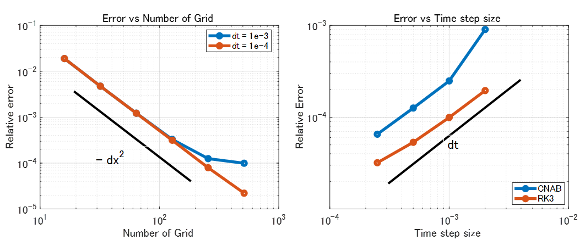

# <span style="color:rgb(213,80,0)">非圧縮性 Navier-Stokes 方程式の数値解法４：ソルバー精度検証</span>

Copyright (c) 2020, The MathWorks, Inc.

# はじめに

Navier-Stokes 方程式を数値的に解くシリーズ、第４回目です。

-  [非圧縮性 Navier-Stokes 方程式の数値解法１：導入編](https://qiita.com/eigs/items/628a2aeb3cb9eef91093) 
-  [非圧縮性 Navier-Stokes 方程式の数値解法２：拡散項の陰解法](https://qiita.com/eigs/items/5a62d9aff7d83af55099) 
-  [非圧縮性 Navier-Stokes 方程式の数値解法３：陰解法の解き方比較](https://qiita.com/eigs/items/81ceaf8d0abc426d29d7) 
-  **非圧縮性 Navier-Stokes 方程式の数値解法４：ソルバー精度検証（この記事）** 

ここまで非圧縮性 Navier-Stokes 方程式を解くための手法・部品についていろいろ紹介してきましたが、そもそも Navier-Stokes 方程式が解けているのか？という点について（ようやく・・）検証してみます。

# 本記事の内容

ある外力項を加えた Navier-Stokes 方程式の数値解と解析解と比較することで、

-  時間積分の精度（1次精度） 
-  空間微分の精度（2次精度） 

を確認します。以下結果ですが、、想定通りですね。

<p style="text-align:left"></p>

## 実行環境
-  MATLAB R2020a 
-  Signal Processing Toolbox（ポワソン方程式の解法に <samp>dct</samp> を使う場合 ） 
-  Symbolic Math Toolbox（なくても大丈夫。あると嬉しい） 

# Method of Manufactured Solution

Navier-Stokes 方程式が ”ある解” を満たすような外力項を追加で加えて数値解の誤差を検証します。まず外力項を加えた Navier-Stokes 方程式と質量保存の式を考えます。

 $$ \begin{array}{rl} \frac{\partial u}{\partial t}+u\cdot \nabla u & =-\nabla p+\frac{1}{Re}\nabla^2 u+f\\ \nabla \cdot u & =0 \end{array} $$ 

ここで速度（ $u,v$ ）と圧力（ $p$ ）の式を代入すれば必要な外力項 ${\mathrm{f}}$  も分かりますね。もちろん"ある解"は質量保存の式を満たすものある必要があります。


解析解と数値解の誤差は以下の式で評価します。

 $$ L_2 =\sqrt{\frac{\sum_{i,k} ({\mathrm{a}\mathrm{n}\mathrm{a}\mathrm{l}\mathrm{y}\mathrm{t}\mathrm{i}\mathrm{c}\mathrm{s}\mathrm{o}\mathrm{l}.}-{\mathrm{n}\mathrm{u}\mathrm{m}\mathrm{e}\mathrm{r}\mathrm{i}\mathrm{c}\mathrm{a}\mathrm{l}\mathrm{s}\mathrm{o}\mathrm{l}.})^2 }{\sum_{i,k} ({\mathrm{a}\mathrm{n}\mathrm{a}\mathrm{l}\mathrm{y}\mathrm{t}\mathrm{i}\mathrm{c}\mathrm{s}\mathrm{o}\mathrm{l}.})^2 }} $$ 

この方法、学生時は Method of Manufactured Solution など呼んだりしていましたが、他の名前をご存知の方コメントください。

# 減衰する 2 次元渦

ここではテストケースとして以下の時間とともに減衰する 2  次元渦を使います。 $Re$ （レイノルズ数）が小さい（粘性が高い）と減衰も早くなりますし、 $a$ が領域内の渦の数を決めます。ここでは領域を  $a=2\pi$ とします。

 $$ \begin{array}{rll} u(x,y,t) & = & -\sin \left(ax\right)\cos \left(ay\right)\exp \left(-\frac{2t}{Re}\right),\\ v(x,y,t) & = & \cos \left(ax\right)\sin \left(ay\right)\exp \left(-\frac{2t}{Re}\right),\\ p(x,y,t) & = & \frac{1}{4}\left(\cos \left(2ax\right)+\sin \left(2ay\right)\right)\exp \left(-\frac{4t}{Re}\right) \end{array} $$ 

<p style="text-align:left"></p>


図：等高線図（速さ）と矢印（流れの方向）


以下で実際に検証しますが、質量保存の式は満たしています。また、Navier-Stokes 方程式に代入すると外力項は以下のように求まります。

 $$ \begin{array}{rll} f_x (x,y,t) & = & -\frac{1}{Re}\left\lbrace 2\left(1-a^2 \right)\exp \left(-\frac{2t}{Re}\right)\cos \left(ay\right)\sin \left(ax\right)\right\rbrace ,\\ f_z (x,y,t) & = & \frac{1}{Re}\left\lbrace 2\left(1-a^2 \right)\exp \left(-\frac{2t}{Re}\right)\cos \left(ax\right)\sin \left(ay\right)\right\rbrace +\frac{a}{2}\exp \left(-\frac{4t}{Re}\right)\left\lbrace \cos \left(2ay\right)+\sin \left(2ay\right)\right\rbrace  \end{array} $$ 


 $f_x (x,y,t)$ と $f_y (x,y,t)$ を追加して Navier-Stokes 方程式を解けば、上の $u(x,y,t)$ と $v(x,y,t)$ が求まるという話。そしてシミュレーション結果と比較して精度を検証するというのが狙いです。

## 外力項の確認

インストール済みであれば Symbolic Math Toolbox で計算してみますが、ない場合は結果だけ使用します。

```matlab
addpath('../functions/');
clear, close all

if license('checkout','symbolic_toolbox') % Symbolic Math Toolbox がある場合
    syms usol(x,y,t) vsol(x,y,t) psol(x,y,t) fu(x,y,t) fv(x,y,t) Re a
    
    % 解析解の定義
    usol(x,y,t) = -sin(a*x)*cos(a*y)*exp(-2*t/Re);
    vsol(x,y,t) = cos(a*x)*sin(a*y)*exp(-2*t/Re);
    psol(x,y,t) = 1/4*(cos(2*a*x) + sin(2*a*y))*exp(-4*t/Re);
    
    % x 成分（Navier-Stokes）
    fu = diff(usol,t) + usol*diff(usol,x) + vsol*diff(usol,y) + diff(psol,x)...
        - 1/Re*(diff(usol,x,2)+diff(usol,y,2));
    
    % y 成分（Navier-Stokes）
    fv = diff(vsol,t) + usol*diff(vsol,x) + vsol*diff(vsol,y) + diff(psol,y) ...
        - 1/Re*(diff(vsol,x,2)+diff(vsol,y,2));
    
    % 式を簡略化
    fu = simplify(fu);
    fv = simplify(fv,'Steps',1000); % 手間がかかるのでより入念に簡略化
    
    % 計算用に MATLAB 関数にしておきます。
    usolFunc = matlabFunction(usol);
    vsolFunc = matlabFunction(vsol);
    psolFunc = matlabFunction(psol);
    fuFunc = matlabFunction(fu);
    fvFunc = matlabFunction(fv);
    
else % ない場合
    usolFunc = @(x,y,t,Re,a) -exp((t.*-2.0)./Re).*cos(a.*y).*sin(a.*x);
    vsolFunc = @(x,y,t,Re,a) exp((t.*-2.0)./Re).*cos(a.*x).*sin(a.*y);
    psolFunc = @(x,y,t,Re,a) exp((t.*-4.0)./Re).*(cos(a.*x.*2.0)./4.0+sin(a.*y.*2.0)./4.0);
    fuFunc = @(x,y,t,Re,a) -(exp((t.*-2.0)./Re).*cos(a.*y).*sin(a.*x).*(a.^2.*2.0-2.0))./Re;
    fvFunc = @(x,y,t,Re,a) (a.*exp((t.*-4.0)./Re).*(cos(a.*y.*2.0)+sin(a.*y.*2.0)))./2.0+(exp((t.*-2.0)./Re).*cos(a.*x).*sin(a.*y).*(a.^2-1.0).*2.0)./Re;
end
```
## 質量保存の式確認

念のため質量保存の式も確認しておきます。大丈夫ですね。

```matlab
if license('checkout','symbolic_toolbox')
    % 質量保存の式確認
    divergence = diff(usol,x) + diff(vsol,y)
end
```
divergence(x, y, t) = 
 $\displaystyle 0$
 

# コードの変更箇所

[非圧縮性 Navier-Stokes 方程式の数値解法２：拡散項の陰解法](https://qiita.com/eigs/items/5a62d9aff7d83af55099) まではキャビティ流れを想定していましたので、境界条件として上辺の速度だけが非ゼロでした。ここではまた任意の外力項に加えて、任意の速度を境界条件に設定できるよう変更を加えています。


詳細は <samp>updateVelocityField_CNAB.m</samp> や <samp>updateVelocityField_RK3.m</samp> に譲りますが、大きな変更箇所は以下の2点。


1つ目は拡散項の陰解法を解くにあたっての境界条件

<pre>
Lubc(1,:) = velbc1.uLeft(2:end-1)/dx^2;
Lubc(end,:) = velbc1.uRight(2:end-1)/dx^2;
Lubc(:,1) = 2*velbc1.uBottom(2:end-1)/dy^2;
Lubc(:,end) = 2*velbc1.uTop(2:end-1)/dy^2;  
</pre>

ここは 1 ステップ先の速度場を使用する必要があります。

 $$ \begin{array}{rl} \frac{u^{n+1} -u^n }{dt} & =-Gp-\frac{3}{2}{{Nu}}^n +\frac{1}{2}{{Nu}}^{n-1} +\frac{1}{2Re}\left({{Lu}}^{n+1} +bc_L^{n+1} +{{Lu}}^n +bc_L^n \right)\\ {DG}p^{\prime }  & =Du^* +bc_D^{n+1}  \end{array} $$ 

の $bc_L^{n+1}$ と $bc_D^{n+1}$ の項です。


2つ目は外力項です。

<pre>
% 3-1. get derivative for u
Nu = (uuce(2:end,:) - uuce(1:end-1,:))/dx;
Nu = Nu + (uvco(2:end-1,2:end) - uvco(2:end-1,1:end-1))/dy;
% forcing
Nu = Nu - uForce;

% 3-2. get derivative for v
Nv = (vvce(:,2:end) - vvce(:,1:end-1))/dy;
Nv = Nv + (uvco(2:end,2:end-1) - uvco(1:end-1,2:end-1))/dx;
% forcing
Nv = Nv - vForce;
</pre>

こちらは非線形項に加えておきます。

### 境界条件設定上の注意点

任意の速度を設定できるとはいえ、計算領域への流入と流出はバランスしている必要があります。<samp>checkNSSolverError.m</samp> 内では

<pre>
% divergence check
inflow = sum(velbc.vBottom(2:end-1))*dx + sum(velbc.uLeft(2:end-1))*dy;
outflow = sum(velbc.vTop(2:end-1))*dx + sum(velbc.uRight(2:end-1))*dy;
assert(abs(inflow - outflow) < eps, "Inflow flux must match the outflow flux.")
</pre>

でチェックしています

# 精度検証の条件設定

早速検証を行いましょう。上でも書きましたが、ここでは

```matlab
a = 2*pi;
Re = 100;
```

として計算します。 $a$ の値を大きくすると渦の数が増えて空間微分の誤差が増えそうな気がしますね。さて、空間微分と時間積分の精度それぞれ検証してみます。


解析解との誤差を返す関数 <samp>checkNSSolverError</samp> としてまとめていますが、入力引数の数が多くて雑多な感じになっちゃいましたが、これはこれで実直で分かりやすいかもしれないのでこのままにしておきます。

<pre>
N = 64, dt = 0.01, tEnd = 10;
checkNSSolverError(Re,a,N,dt,tEnd,fuFunc,fvFunc,usolFunc,vsolFunc,psolFunc,'RK3',true,true);
</pre>

条件設定の時間ステップ <samp>dt</samp> で計算し <samp>tEnd</samp> での誤差を返します。その際に <samp>fuFunc, fvFunc</samp> などは上で計算した外力項、<samp>usolFunc</samp> などは解析解です。


最後の <samp>true, true</samp> は可視化設定です（1つ目：Figure 作成、2つ目: GIF作成）。

<p style="text-align:left"></p>


といった具合で比較します。速さの等高線、矢印は速度方向を表します。渦が減衰している様子が分かります。

# 空間微分精度検証

まずは空間微分の精度。


ここではできるだけ時間積分による誤差は小さくしておきたいので、3 段階のルンゲ・クッタ法を使用して <samp>t = 0.01</samp> における誤差をグリッド数を変えて（<samp>Nx = Ny = 16</samp> から <samp>512</samp> まで）確認します。確認のため 2 つの時間ステップサイズを使います。

```matlab
tEnd = 0.01;

Ns = [16,32,64,128,256,512];
dts = [1e-3, 1e-4];
L2error_spacial = zeros(length(Ns),length(dts));

for jj=1:length(dts)
    dt = dts(jj);
    for ii=1:length(Ns)
        N = Ns(ii);
        L2error_spacial(ii,jj) = checkNSSolverError(Re,a,N,dt,tEnd,fuFunc,fvFunc,...
            usolFunc,vsolFunc,psolFunc,'RK3',false,false);
    end
end
```

```TextOutput
(N,dt) = (16,0.001) error: 0.019005 at 0.01 CFL: 0.01631
(N,dt) = (32,0.001) error: 0.0047481 at 0.01 CFL: 0.032155
(N,dt) = (64,0.001) error: 0.0012257 at 0.01 CFL: 0.06408
(N,dt) = (128,0.001) error: 0.00032862 at 0.01 CFL: 0.12806
(N,dt) = (256,0.001) error: 0.00012523 at 0.01 CFL: 0.25609
(N,dt) = (512,0.001) error: 9.9427e-05 at 0.01 CFL: 0.51217
(N,dt) = (16,0.0001) error: 0.019003 at 0.0101 CFL: 0.0016296
(N,dt) = (32,0.0001) error: 0.0047471 at 0.0101 CFL: 0.0032127
(N,dt) = (64,0.0001) error: 0.001223 at 0.0101 CFL: 0.0064034
(N,dt) = (128,0.0001) error: 0.00031469 at 0.0101 CFL: 0.012799
(N,dt) = (256,0.0001) error: 7.9397e-05 at 0.0101 CFL: 0.025596
(N,dt) = (512,0.0001) error: 2.2161e-05 at 0.0101 CFL: 0.051193
```
## 何次精度だったかな？

プロットしてみます。

```matlab
%% ここからプロット
figure
loglog(Ns,L2error_spacial,'Marker','o','LineWidth',4);

% 見栄えの微調整
handle_axes = gca;
handle_axes.FontSize = 14;
box(handle_axes,'on');
grid(handle_axes,'on');

% legend を作成
legend({'dt = 1e-3','dt = 1e-4'},'Location','best');
grid on
xlabel('Number of Grid')
ylabel('Relative error')
title('Error vs Number of Grid')
hold off

annotation('line',[0.24 0.62],[0.64 0.25],'LineWidth',3)
annotation('textbox',[0.3 0.3 0.2 0.1],...
    'String',{'- dx^2'},...
    'FontSize',18,'EdgeColor',[1 1 1]);
```

<center></center>


無事に 2 次精度が確認できますね。 <samp>dt = 1e-3</samp> の時グリッド数 <samp>N = 256, 512</samp> で誤差が多めに出ているのは、時間積分に由来する誤差の影響と見ています。

# 時間積分精度検証

上の結果から、時間積分の精度を検証する場合には、空間微分による誤差で埋もれてしまわないように <samp>Nx = Ny = 512</samp> で試すとよさそうですね。ただ、<samp>dt  = 1e-4</samp> まで小さくすると空間微分誤差に支配されていそうです。


この辺の考察をもとに <samp>dt</samp> を <samp>dt = 1e-3</samp> から <samp>dt = 1e-4</samp> の間で時間ステップサイズを変え、 <samp>t = 0.01</samp> における誤差を確認します。ルンゲ・クッタ法（RK3）だけでなく、クランクニコルソン・アダムスバッシュフォース法（CNAB）も試します。

```matlab
N = 512;
tEnd = 0.01;
dts = 1e-3*[2,1,1/2,1/4];
L2error_temporal = zeros(length(dts),2);

for ii=1:length(dts)
    dt = dts(ii);
    L2error_temporal(ii,1) = checkNSSolverError(Re,a,N,dt,tEnd,fuFunc,fvFunc,...
        usolFunc,vsolFunc,psolFunc,'CNAB',false,false);
    L2error_temporal(ii,2) = checkNSSolverError(Re,a,N,dt,tEnd,fuFunc,fvFunc,...
        usolFunc,vsolFunc,psolFunc,'RK3',false,false);
end
```

```TextOutput
(N,dt) = (512,0.002) error: 0.00090377 at 0.01 CFL: 1.0278
(N,dt) = (512,0.002) error: 0.00019527 at 0.01 CFL: 1.025
(N,dt) = (512,0.001) error: 0.00024862 at 0.01 CFL: 0.51276
(N,dt) = (512,0.001) error: 9.9427e-05 at 0.01 CFL: 0.51217
(N,dt) = (512,0.0005) error: 0.00012595 at 0.01 CFL: 0.25616
(N,dt) = (512,0.0005) error: 5.3331e-05 at 0.01 CFL: 0.25602
(N,dt) = (512,0.00025) error: 6.5312e-05 at 0.01 CFL: 0.12803
(N,dt) = (512,0.00025) error: 3.1945e-05 at 0.01 CFL: 0.12799
```

## 何次精度だったかな？

プロットしてみます。

```matlab
%% ここからプロット
figure
loglog(dts,L2error_temporal,'Marker','o','LineWidth',4);

% 見栄えの微調整
handle_axes = gca;
handle_axes.FontSize = 14;
box(handle_axes,'on');
grid(handle_axes,'on');

% legend を作成
legend({'CNAB','RK3'},'Location','best');
grid on
xlabel('Time step size')
ylabel('Relative Error')
title('Error vs Time step size')
hold off

annotation('line',[0.32 0.75],[0.24 0.69],'LineWidth',3)
annotation('textbox',[0.5 0.35 0.2 0.1],...
    'String',{'dt'},...
    'FontSize',18,'EdgeColor',[1 1 1]);
xlim([1e-4,1e-2])
ylim([1e-5,1e-3])
```

<center></center>


1 次精度ですね。同じ時間ステップサイズならルンゲ・クッタ法の方が誤差が少ない結果になりました。ただ 3 段階のルンゲ・クッタが 1 次精度というのは予定通りですが少し寂しい。

# まとめ

Method of Manufactured Solution を使って空間微分の 2 次精度、時間積分の 1 次精度を確認しました。空間微分の精度を高次化するのは単純に手間ですし、ステンシルが広がることで境界の取り扱いや離散サイン変換が使えるか否かの再検証など必要。ただ、グリッド数を10倍にしても誤差が 1/100 にしかならないのは、3 次元への展開も考えると多少心もとない気もします。


3 段階のルンゲ・クッタで 1 次精度！？という気はしますが、これは定式化の段階（LU分解）の段階で織り込み済み（参照：[非圧縮性 Navier-Stokes 方程式の数値解法２：拡散項の陰解法](https://qiita.com/eigs/items/5a62d9aff7d83af55099)）という理解です。こうすれば高次化できますよ、というヒントあればコメントお待ちしております。

